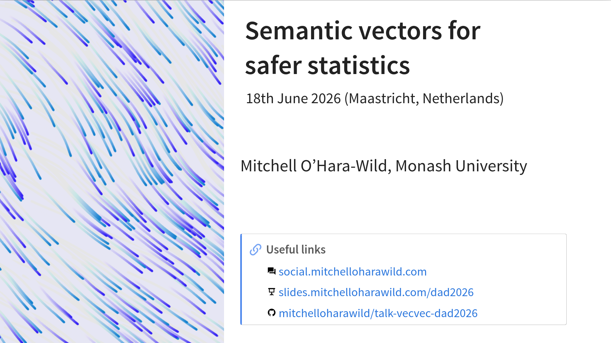

<!-- README.md is generated from README.qmd. Please edit that file -->

# Semantic vectors for safer statistics

<!-- badges: start -->
<!-- badges: end -->

Slides and notes for a presentation about vectorised statistics at Maastricht University's Department of Data Analytics and Digitalisation (DAD) in Maastricht, Netherlands (18 June 2026).

A recording of this presentation is available on YouTube here: <https://youtu.be/OM6oquHW8OQ>

#### Abstract

Statistical analysis on temporal, spatial, graph, and probabilistic data is error-prone when the data types lack intrinsic structure. Outputs from models typically return these composite data types separately, requiring the user to assemble and apply the results correctly. This reduces the accessibility of statistics and results in error-prone analysis. Representing these data types using composite vector types makes statistical operations and data analysis easier.

In this talk, I will introduce the application of vectorised statistical operations across common dimensions not otherwise handled in traditional data structures. The vectors of vectors data type implemented in the vecvec R package is foundational for creating efficient mixed data types. The distributional and mixtime R packages leverage vecvec in order to create vectors that mix different distributions and temporal granularities together. Storing distributions with different shapes and parameterisations together in the same vector abstracts away the data handling complexity while providing a user-friendly interface for calculating distributional statistics such as the mean, quantiles, and densities. Similarly, storing time at different granularities allows combining data from different sources and facilitates forecasts across multiple levels of temporal aggregation.

These semantic vectors combine naturally in tidy rectangular data to facilitate statistically sensible multi-dimensional analysis. For instance, pairing temporal and distributional vectors yields a dataset ready for probabilistic time series forecasting, or pairing temporal and spatial vectors a dataset ready for spatio-temporal analysis.

#### Structure

1. Time series forecasting domain - time, probability, graph
2. Semantic variables vectors (time, distribution, spatial, graph, ...).
3. Complete (distributional), wip (mixtime), future (graphvec).
4. Basics of distributional vectors (single distribution types).
5. Mixed type vectors of vectors. A brief showcase of the vecvec package.
6. Operations on semantic vectors with the distributional package.
7. Other semantic vectors (mixtime, graphvec, sf).
8. Combining semantic variables (distributional+mixtime == forecasts).
9. Interoperability between semantic vectors (ivs, temporal uncertainty, ...).

### Format

~50 minutes (>30 minute talk, ~20 minute discussion)

### Speaker

[**Mitchell O'Hara-Wild**](https://mitchelloharawild.com/) (he/him) is a PhD candidate at [Monash University](https://www.monash.edu) with over 10 years of experience in time series forecasting, open source software development, and teaching statistics. His recent research focuses on semantic vector types that preserve the structure of probabilistic, temporal, and graph data for safer statistical analysis, including the [distributional](https://pkg.mitchelloharawild.com/distributional/), [mixtime](https://pkg.mitchelloharawild.com/mixtime/), and [graphvec](https://pkg.mitchelloharawild.com/graphvec/) R packages. These semantics are demonstrated in practice by the [fable](https://fable.tidyverts.org/) forecasting package, which combines these vectors to facilitate probabilistic forecasting workflows at scale.
